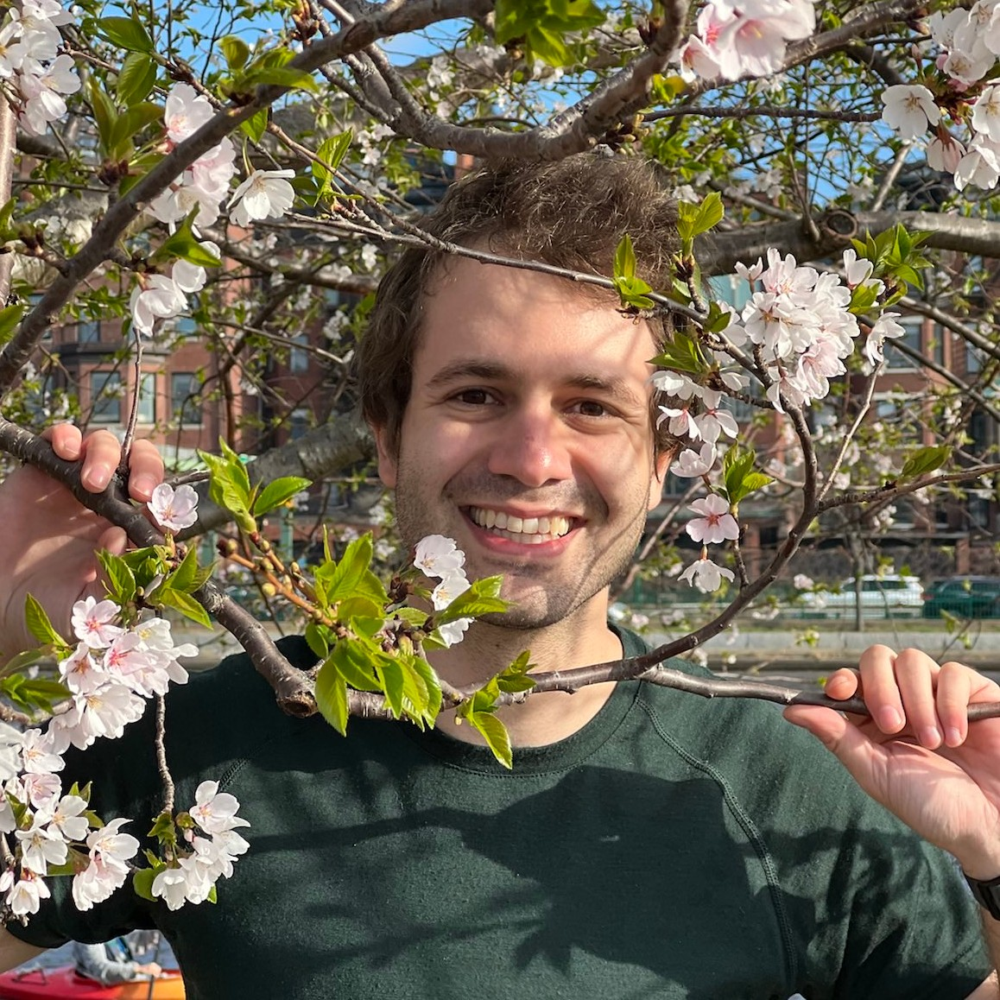
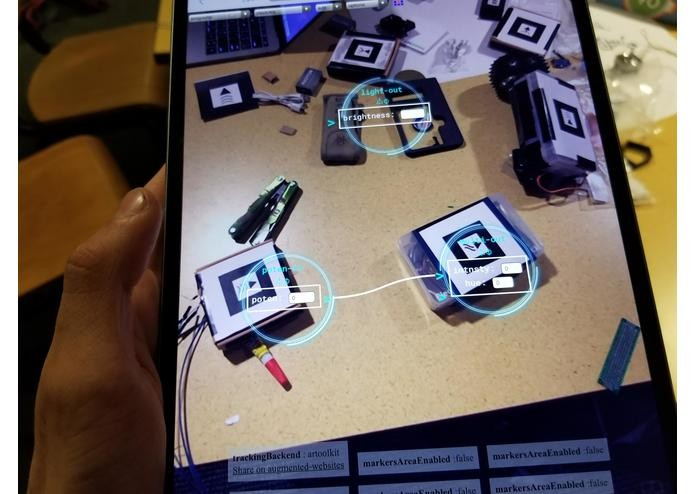
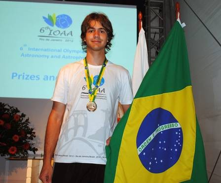
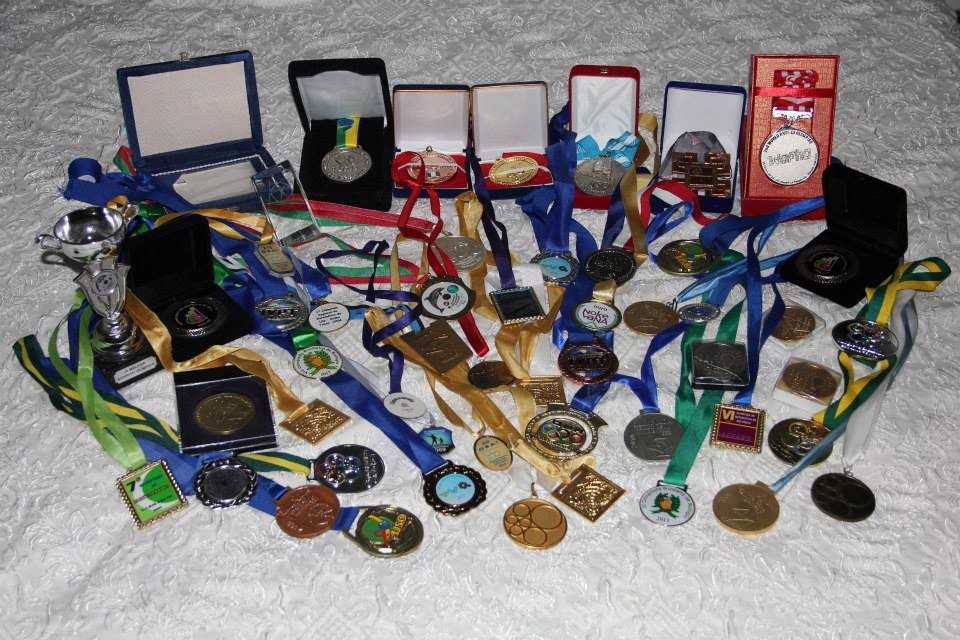
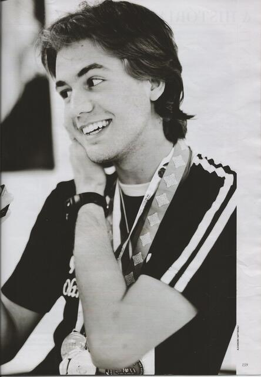
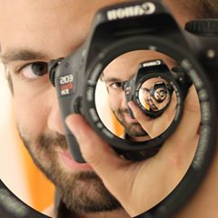

# Ivan Tadeu Ferreira Antunes Filho

**Under construction**
# Index 
- [Summary](#Summary)  
- [Awards](#Awards)
- [In the Media](#In_the_Media_(2011-2013))
- [Interests](#Interests)

# Summary

I am a Senior Software Engineer at [Google Cambridge](https://careers.google.com/locations/cambridge/), previously Head of Algorithms at [Radix Labs](https://web.archive.org/web/20220330050525/https://www.radix.bio/), and worked at Facebook, Quantlab, and Indeed.com.

Master of Engineering in Computer Science, from MIT, with a degree in Computer Science and Electrical Engineering, and Mathematics also from MIT. 

I've worked primarily in Algorithms and Performance, and secondarily in Systems and Toolchains, but I have also worked with user interfaces and data visualization tools. 

Previous work includes 
- Adding support for Thin Link Time Optimization to Google's Android Toolchain, resulting in over $50M in savings, 5-7% smaller apps and 5% improvement in performance.
- implementing Resource Constrained Project Scheduling algorithms from research papers and improving on them, together with implementing a UI for clients to use; 
- modifying LLVM to make LTO more friendly for toolchains; 
- writing queries to analyse revenue data from advertisers;
- Chatbot to help diagnose code issues faster
- Analyzing an embedded operating system written in rust for unsafe code and exploits;

Originally from Brazil, which I represented in multiple International Science Olympiads. [IPhO](https://ipho-unofficial.org/timeline/2012/individual) and IJSO gold medalist, [IOAA](https://www.gov.br/mast/pt-br/assuntos/noticias/2012/agosto/brasil-encerra-participacao-na-olimpiada-de-astronomia-com-tres-medalhas), [IOL](https://ioling.org/results/2012), [WoPhO](https://web.archive.org/web/20130807045700/http://www.wopho.org/news-news.php?id=29) and [OIaB](https://olimpiadadebiologia.edu.es/wp-content/uploads/2014/09/ResultadosOIAB-2012.pdf) Silver medalist.

I am a jack of all trades, constantly learning about new areas so I can better interface with people. My background competing in [physics](https://ipho-unofficial.org/timeline/2012/individual), biology, linguistics, astronomy, chemistry, mathematics and informatics, together with graduating in electrical engineering, computer science and mathematics gives me a good interdisciplinary background to approach problems. 

I also have experience helping take care of [multiple types of animals](me_and_animals.md), including armadillos, anteaters, parrots and toucans. My main current hobby is ballroom dancing.

Teaching is also one of my skills and interests. I was a teaching assistant for algorithms at MIT for 3 semesters, with ratings equal or above 6.5/7, as well as the main instructor for a month long algorithm course at MIT in January 2019 with ratings 6.4/7. I am of the opinion that rapid feedback is of main importance when learning new concepts, and courses should use current tools to do so when possible.  

# Experience

You can see some of the recent things I've worked on on my [portfolio](portfolio.md) or on my [resume](resume.md) page, depending if you are interested in my side projects or more on academics and internships. 

# Awards

## MIT competitions 

- Our [AugModules](https://devpost.com/software/augmodules) project, built by me and Allan Costa won the Verizon best IOT project at the Make MIT hackathon
- First place in the [MIT Mobile Autonomous Systems LABoratory](http://maslab.mit.edu/wiki/index.php?title=Team_Six/Final_Paper) competition in 2015. 

## Medals in Science Olympiads (2006-2013)

I took part in multiple science olympiads back in highschool, here is a list of the competitions. 

### International medals

| Competition                                                               | Year      | Medal             | Subjects                                        |
| ------------------------------------------------------------------------- | --------- | ----------------- | ----------------------------------------------- |
| International Junior Science Olympiad (IJSO)                                     | 2009      | Silver            | Physics, Chemistry and Biology                  |
| International Junior Science Olympiad (IJSO)                                    | 2010      | Gold              | Physics, Chemistry and Biology                  |
| International Junior Science Olympiad (IJSO) – Team practical competition        | 2010      | Bronze            | Physics, Chemistry and Biology                  |
| International Physics Olympiad (IPhO)                                            | 2011      | Bronze            | Physics                                         |
| International Astronomy and Astrophysics Olympiad (IOAA)                         | 2011      | Bronze            | Astronomy, Astrophysics and basic data analysis |
| International Physics Olympiad (IPhO)                                            | 2012      | Gold              | Physics                                         |
| Ibero-American Computer Correspondence Contest (CIIC)                     | 2011      | Silver            | Informatics                                     |
| Physics Cup                                                               | 2012      | 8th place         | Physics                                         |
| International Astronomy and Astrophysics Olympiad (IOAA)                         | 2012      | Silver            | Astronomy, Astrophysics and Basic Data Analysis |
| Iberoamerican Biology Olympiad                                            | 2012      | Silver            | General Biology                                 |
| Iberoamerican Biology Olympiad – Rally (mixed countries team competition) | 2012      | Gold              | Biology, Team Work                              |
| International Linguistics Olympiad (IOL)                                        | 2012      | Silver            | Linguistics, Logic                              |
| World Physics Olmpyad (WoPhO)                                             | 2012/2013 | Silver            | Physics                                         |

### All medals

| Competition                                                               | Year      | International / National / State / Regional | Medal             | Subjects                                        |
| ------------------------------------------------------------------------- | --------- | -------------------------------------- | ----------------- | ----------------------------------------------- |
| Lins Regional Mathematics Olympiad                                        | 2006      | Regional                               | Gold              | Mathematics                                     |
| Lins Regional Mathematics Olympiad                                        | 2007      | Regional                               | Gold              | Mathematics                                     |
| Brazilian Mathematics Olympiad                                            | 2007      | National                               | Gold              | Mathematics                                     |
| Brazilian Mathematics Olympiad                                            | 2008      | National                               | Bronze            | Mathematics                                     |
| Sao Paulo State Mathematics Olympiad                                     | 2008      | State                                  | Gold              | Mathematics                                     |
| Rio Preto Regional Mathematics Olympiad                                   | 2008      | Regional                               | Gold              | Mathematics                                     |
| Brazilian Mathematics Olympiad                                            | 2009      | National                               | Honorable Mention | Mathematics                                     |
| Sao Paulo State Mathematics Olympiad                                     | 2009      | State                                  | Gold              | Mathematics                                     |
| Rio Preto Regional Mathematics Olympiad                                   | 2009      | Regional                               | Gold              | Mathematics                                     |
| Brazilian Physics Olympiad                                                | 2009      | National                               | Gold              | Physics                                         |
| Sao Paulo State Physics Olympiad                                         | 2009      | State                                  | Gold              | Physics                                         |
| Brazilian Junior Chemistry Olympiad                                       | 2009      | National                               | Silver            | Chemistry                                       |
| Brazilian Junior Science Olympiad                                         | 2009      | National                               | Gold              | Physics, Chemistry and Biology                  |
| International Junior Science Olympiad                                     | 2009      | **International**                          | Silver            | Physics, Chemistry and Biology                  |
| Brazilian Astronomy Olympiad                                              | 2009      | National                               | Silver            | Astronomy and Astrophysics                      |
| Brazilian Mathematics Olympiad                                            | 2010      | National                               | Honorable Mention | Mathematics                                     |
| Sao Paulo State Mathematics Olympiad                                     | 2010      | State                                  | Silver            | Mathematics                                     |
| Rio Preto Regional Mathematics Olympiad                                   | 2010      | Regional                               | Gold              | Mathematics                                     |
| Brazilian Physics Olympiad                                                | 2010      | National                               | Silver            | Physics                                         |
| Sao Paulo State Physics Olympiad                                         | 2010      | State                                  | Gold              | Physics                                         |
| Brazilian Chemistry Olympiad                                              | 2010      | National                               | Honorable Mention | Chemistry                                       |
| Brazilian Junior Science Olympiad                                         | 2010      | National                               | Gold              | Physics, Chemistry and Biology                  |
| International Junior Science Olympiad                                     | 2010      | **International**                          | Gold              | Physics, Chemistry and Biology                  |
| International Junior Science Olympiad – Team practical competition        | 2010      | **International**                          | Bronze            | Physics, Chemistry and Biology                  |
| Brazilian Astronomy Olympiad                                              | 2010      | National                               | Gold              | Astronomy and Astrophysics                      |
| Brazilian Informatics Olympiad                                            | 2010      | National                               | Gold              | Programming                                     |
| Brazilian Mathematics Olympiad                                            | 2011      | National                               | Bronze            | Mathematics                                     |
| Sao Paulo State Mathematics Olympiad                                     | 2011      | State                                  | Gold              | Mathematics                                     |
| Brazilian Physics Olympiad                                                | 2011      | National                               | Silver            | Physics                                         |
| Sao Paulo State Physics Olympiad                                         | 2011      | State                                  | Gold              | Physics                                         |
| International Physics Olympiad                                            | 2011      | **International**                          | Bronze            | Physics                                         |
| Brazilian Chemistry Olympiad                                              | 2011      | National                               | Honorable Mention | Chemistry                                       |
| On-line Chemistry Contest                                                 | 2011      | National                               | Silver            | Chemistry                                       |
| Sao Paulo State Chemistry Olympiad                                        | 2011      | State                                  | Silver            | Chemistry                                       |
| Brazilian Physics Tournament                                              | 2011      | National                               | Bronze            | Physics and Argumentation. Team competition     |
| Brazilian Astronomy Olympiad                                              | 2011      | National                               | Gold              | Astronomy and Astrophysics                      |
| International Astronomy and Astrophysics Olympiad                         | 2011      | **International**                          | Bronze            | Astronomy, Astrophysics and basic data analysis |
| Brazilian Informatics Olympiad                                            | 2011      | National                               | Silver            | Programming                                     |
| Brazilian Biology Olympiad                                                | 2011      | National                               | 10th place        | General Biology                                 |
| Brazilian Linguistics Olympiad                                            | 2011      | National                               | Gold              | Linguistics, Logic                               |
| International Linguistics Olympiad                                        | 2011      | **International**                          | Participant            | Linguistics, Logic                              |
| International Physics Olympiad                                            | 2012      | **International**                          | Gold              | Physics                                         |
| Ibero-American Computer Correspondence Contest (CIIC)                     | 2011      | **International**                          | Silver            | Informatics                                     |
| Physics Cup                                                               | 2012      | **International**                          | 8th place         | Physics                                         |
| Sao Paulo State Chemistry Olympiad                                        | 2012      | State                                  | Silver            | Chemistry                                       |
| Brazilian Physics Tournament                                              | 2012      | National                               | Silver            | Physics and Argumentation. Team competition     |
| Brazilian Astronomy Olympiad                                              | 2012      | National                               | Gold              | Astronomy and Astrophysics                      |
| International Astronomy and Astrophysics Olympiad                         | 2012      | **International**                          | Silver            | Astronomy, Astrophysics and Basic Data Analysis |
| Brazilian Biology Olympiad                                                | 2012      | National                               | 1st place         | General Biology                                 |
| Iberoamerican Biology Olympiad                                            | 2012      | **International**                          | Silver            | General Biology                                 |
| Iberoamerican Biology Olympiad – Rally (mixed countries team competition) | 2012      | **International**                          | Gold              | Biology, Team Work                              |
| Brazilian Linguistics Olympiad                                            | 2012      | National                               | Gold              | Linguistics, Logic                              |
| International Linguistics Olympiad                                        | 2012      | **International**                          | Silver            | Linguistics, Logic                              |
| Brazilian Mathematical Olympiad                                           | 2012      | National                               | Honorable Mention     | Mathmatics                                      |
| World Physics Olmpyad (WoPhO)                                             | 2012/2013 | **International**                          | Silver            | Physics                                         |
| Brazilian Biology Olympiad                                                | 2013      | National                               | Gold              | General Biology                                 |
| Brazilian Linguistics Olympiad                                         | 2013      | National                               | Gold              | Linguistics, Logic                               |
### Summary of results

| Level         | Gold Medals | Silver Medals | Bronze Medals | Honorable Mentions | Total |
| ------------- | ----------- | ------------- | ------------- | ------------------ | ----- |
| Regional      | 5           | 0             | 0             | 0                  | 5     |
| State         | 5           | 3             | 1             | 0                  | 9     |
| National      | 13          | 7             | 4             | 5                  | 29    |
| Iberoamerican | 1           | 2             | 0             | 0                  | 3     |
| International | 2           | 4             | 3             | 0                  | 9     |
| Total         | 26          | 16            | 8             | 5                  | 54    |

### New Medals for Brazil

| World Physics Olmpyad (WoPhO)      | 2012/2013 | International | Silver |
| ---------------------------------- | --------- | ------------- | ------ |
| International Linguistics Olympiad | 2012      | International | Silver |

# In the Media (2011-2013)

And because of the science olympiads, I've also appeared in the media a
number of times. Here are some interviews to newspapers, magazines and
TV. 

-   [**Folha - Jovem de 17 anos ganha provas internacionais de física, linguística e astronomia**](https://web.archive.org/web/20121030210719/http://www1.folha.uol.com.br/educacao/1144885-jovem-de-17-anos-ganha-provas-internacionais-de-fisica-linguistica-e-astronomia.shtml)
-   [Estudante do Centro-Oeste Paulista é campeão internacional de ciências](http://g1.globo.com/sp/bauru-marilia/noticia/2012/08/estudante-do-centro-oeste-paulista-e-campeao-internacional-de-ciencias.html)
-   [Medalhista em olimpíadas científicas dá dicas para dominar as Exatas](http://extra.globo.com/noticias/educacao/vida-de-calouro/medalhista-em-olimpiadas-cientificas-da-dicas-para-dominar-as-exatas-5967334.html)
-   [Brasil ganha quatro medalhas na Olimpíada Internacional de Física](http://g1.globo.com/vestibular-e-educacao/noticia/2012/07/brasil-ganha-quatro-medalhas-na-olimpiada-internacional-de-fisica.html)
- [Brasil encerra participação na olimpíada de astronomia com três medalhas](https://www.gov.br/mast/pt-br/assuntos/noticias/2012/agosto/brasil-encerra-participacao-na-olimpiada-de-astronomia-com-tres-medalhas)
-   [Brasil conquista medalhas em Olimpíada Internacional de Astronomia e Astrofísica](http://odia.ig.com.br/portal/cienciaesaude/brasil-conquista-medalhas-em-olimp%C3%ADada-internacional-de-astronomia-e-astrof%C3%ADsica-1.476164)
-   [Ivan Tadeu: as lições de um jovem talento- (Objetivo)](http://www.objetivo.br/noticias.asp?id=3801)
-   [Brasileiro vence Olimpíada Internacional de Física](http://www.brasil.gov.br/noticias/arquivos/2012/08/1o/olimpiada-internacional-de-fisica-da-medalha-de-ouro-a-brasileiro)
-   [Brasileiro ganha ouro em olimpíada internacional de física-a folha](http://www.afolha.com.br/suplementos.php?noticia=767)
-   [Brasileiro ganha ouro em Olimpíada Internacional de Física &#x2013;  www.jornaldaciencia.org.br](http://www.jornaldaciencia.org.br/Detalhe.jsp?id=83527)
-   [(Video)Estudante do Centro-Oeste Paulista é campeão internacional de ciências](http://globotv.globo.com/tv-tem-interior-sp/tem-noticias-1a-edicao-baurumarilia/v/estudante-do-centro-oeste-paulista-e-campeao-internacional-de-ciencias/2106698/)
-   [**(TV interview)De Frente Com Gabi 16/10/2012 &#x2013; Ivan Antunes Filho**](http://www.sbt.com.br/defrentecomgabi/noticias/10939/Ja-paquerei-uma-menina-falando-das-estrelas-diz-o-campeao-do-intelecto-Ivan-Antunes-Filho.html)
-   [Depois da aula&#x2026;O universo complementar das Olimpíadas Científicas](http://www.atitudesaopaulo.com.br/?p=8167)
-   [(Video) Um aluno de 17 anos na elite mundial](http://jornaldagazeta.tvgazeta.com.br/index.php?option=com_videoflow&task=play&id=7947)
-   [(Video) Fetec é aberta com participação de estudantes de escolas públicas e particulares](http://globotv.globo.com/tv-morena/mstv-1a-edicao-campo-grande/v/fetec-e-aberta-com-participacao-de-estudantes-de-escolas-publicas-e-particulares/2204230/)
-   [Feira de Tecnologia começa hoje no Ginásio Moreninho](https://correiodoestado.com.br//noticias/feira-de-tecnologia-comeca-hoje-no-ginasio-moreninho/163798)
-   [Brasileiros ganham medalhas em olimpíada internacional de física](http://g1.globo.com/educacao/noticia/2011/07/brasileiros-ganham-medalhas-em-olimpiada-internacional-de-fisica.html)
-   [Referência em tecnologia, MIT admite quatro brasileiros para graduação](http://g1.globo.com/educacao/noticia/2013/03/referencia-em-tecnologia-mit-admite-quatro-brasileiros-para-graduacao.html)
-   [Olimpíadas Escolares &#x2013; Terra Educação](http://www.terra.com.br/noticias/educacao/infograficos/olimpiadas-escolares/)
-   [MY Camper Ivan Tadeu Ferreira Antunes Filho: Discovering the incredible world through science](http://www.myscience.fi/index.php?id=358)
-   [Menino de Ouro - Revista Contigo](revista_contigo.md)

 [, one of the most famous interviewers in Brazil, during a break in her interview show.")](./jpg/15959135050940754.jpg) 

 Picture taken with [Marília Gabriela](https://en.wikipedia.org/wiki/Mar%C3%ADlia_Gabriela), one of the most famous interviewers in Brazil, during a break in her interview show, "[De frente com Gabi](https://pt.m.wikipedia.org/wiki/De_Frente_com_Gabi)", winner of the best Brazilian interview program at the time.

Picture for the magazine [Contigo!](https://pt.m.wikipedia.org/wiki/Contigo!), the second largest Brazilian Celebrities' magazine in 2012.

[.")](./jpg/16004082860554037.jpg)

Picture on the largest newspaper in Brazil (Folha)

# Interests

## Photography projections

## Ballroom dancing

## Other

I've helped taking care of far too many injured wild animals while I lived in Brazil. It is hard to describe the experience, but you can see some [pictures here](me_and_animals.md).

I've also had previous blogs:

-   [Ivan - Science Olympiads ](https://olimpiadascientificas.org/vida-de-olimpico/ivan.olimpiadascientificas.com/index.html) In portuguese

### Name Pronunciation 
[ee · VAN – ta·DEW – fay·HEY·ra – an·TOO·niece – fee·LEO]