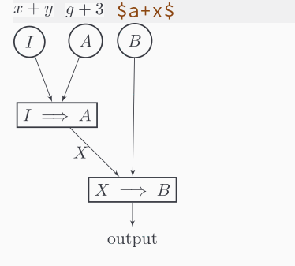

Automatic toggle latex fragments in orgmode when point is in them.

I found a solution by [Konstantin Kliakhandler](http://slumpy.org/blog/2017-02-01-automatic-latex-preview-in-org-mode/), based on a [solution premade by John
Kitchin](http://kitchingroup.cheme.cmu.edu/blog/2015/10/09/Automatic-latex-image-toggling-when-cursor-is-on-a-fragment/).

The code worked fine, however, it was fairly slow, and sometimes it would issue too many commands at once (for example, when it was scrolling).

Therefore, I decided to improve it and make it faster!

The first thing I did was to add a `while-no-input` to the beginning of the code, so that it can be interrupted with user input. The second thing was to add a `(run-with-idle-timer 0.05 nil` This adds a delay of .05 seconds before displaying or removing the image. This is particularly useful when scrolling, because, together with the `while-no-input`   it stops the function from running multiple times while you scroll, or move around the text quickly, or when you take multiple actions that take less than 0.05 seconds.

At last, I improved the performance considerably by using the trick I learned from  [org-inline-image package](https://github.com/Fuco1/org-inline-image/blob/master/org-inline-image.el), i.e that we can get the overlay at point and filter it by a specific property. This way instead of going through a potentially very large list of overlays, we make use of a function that was implemented in C, which is likely much faster, and we only have to go through all the overlays that are defined at point, which are likely much fewer than the number of overlays on the buffer. 

At last I decided to byte compile the function, because, why not? It will be run at the end of every input anyway.

Putting this all together:
```el
    (defvar org-latex-fragment-last nil
      "Holds last fragment/environment you were on.")
    
    (defun my/org-latex-fragment--get-current-latex-fragment ()
      "Return the overlay associated with the image under point."
      (car (--select (eq (overlay-get it 'org-overlay-type) 'org-latex-overlay) (overlays-at (point)))))
    
    (defun my/org-in-latex-fragment-p ()
        "Return the point where the latex fragment begins, if inside
      a latex fragment. Else return false"
        (let* ((el (org-element-context))
               (el-type (car el)))
          (and (or (eq 'latex-fragment el-type) (eq 'latex-environment el-type))
              (org-element-property :begin el))))
    
    (defun org-latex-fragment-toggle-auto ()
      ;; Wait for the s
      (interactive)
      (while-no-input 
        (run-with-idle-timer 0.05 nil 'org-latex-fragment-toggle-helper)))
    
    (defun org-latex-fragment-toggle-helper ()
        "Toggle a latex fragment image "
        (condition-case nil
            (and (eq 'org-mode major-mode)
                 (let* ((begin (my/org-in-latex-fragment-p)))
    	       (cond
    	        ;; were on a fragment and now on a new fragment
    	        ((and
    	          ;; fragment we were on
    	          org-latex-fragment-last
    	          ;; and are on a fragment now
                      begin
    	          ;; but not on the last one this is a little tricky. as you edit the
    	          ;; fragment, it is not equal to the last one. We use the begin
    	          ;; property which is less likely to change for the comparison.
    	          (not (= begin
    		          org-latex-fragment-last)))
    	         ;; go back to last one and put image back
    	         (save-excursion
    	           (goto-char org-latex-fragment-last)
    	           (when (my/org-in-latex-fragment-p) (org-toggle-latex-fragment))
    	           ;; now remove current imagea
                       (goto-char begin)
    	           (let ((ov (my/org-latex-fragment--get-current-latex-fragment)))
    	             (when ov
    	               (delete-overlay ov)))
    	           ;; and save new fragment
    	           (setq org-latex-fragment-last begin)))
                    
    	        ;; were on a fragment and now are not on a fragment
    	        ((and
    	          ;; not on a fragment now
    	          (not begin)
    	          ;; but we were on one
    	          org-latex-fragment-last)
    	         ;; put image back on
    	         (save-excursion
    	           (goto-char org-latex-fragment-last)
    	           (when (my/org-in-latex-fragment-p)(org-toggle-latex-fragment)))
                     
    	         ;; unset last fragment
    	         (setq org-latex-fragment-last nil))
                    
    	        ;; were not on a fragment, and now are
    	        ((and
    	          ;; we were not one one
    	          (not org-latex-fragment-last)
    	          ;; but now we are
    	          begin)
                     (save-excursion
    	           (goto-char begin)
                       ;; remove image
    	           (let ((ov (my/org-latex-fragment--get-current-latex-fragment)))
    	             (when ov
    	               (delete-overlay ov)))
    	           (setq org-latex-fragment-last begin)))
                    ;; else not on a fragment
                    ((not begin)
                     (setq org-latex-fragment-last nil)))))
          (error nil)))
    
    
    
    (add-hook 'post-command-hook 'org-latex-fragment-toggle-auto)
    (setq org-latex-fragment-toggle-helper (byte-compile 'org-latex-fragment-toggle-helper))
    (setq org-latex-fragment-toggle-auto (byte-compile 'org-latex-fragment-toggle-auto))
```
And here is an example!


