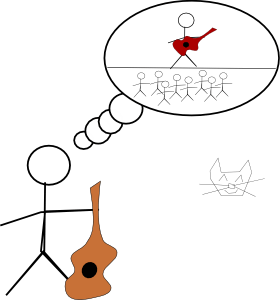

I used to blog a lot in high school.

One blog I was really proud of was [Ivan vida de olimpico](http://olimpiadascientificas.org/vida-de-olimpico/ivan.olimpiadascientificas.com/index.html), which was a website I wrote while I was taking part in science olympiads. The reason I wrote the website was to help incentive people to take part on science olympiads, by showing how I studied, telling stories about the competitions, showing how fun it was!

Before I stopped writing it, I had already reached the stage where was making my own bad drawings to better illustrate the stories

It was great! I received about 50 different visitors per day and answered comments in multiple of the posts. I had written some really great posts about motivation and study and really liked doing so. 

Besides my main blog, I also maintained the website [olimpiadascientificas.com](http://web.archive.org/web/20160112231415/http://www.olimpiadascientificas.com/). We received about 500 visits per day, from all over Brazil. It was the first Brazilian website to help students take part in science olympiads, providing study guides, hints, instructions on how to take part on them and so on. 

But then **what happened**?

I was writing study guides to help people take part in the [biology](http://olimpiadascientificas.org/static/pdf/Resolu%C3%A7%C3%A3o_OBB_VII_fase2.pdf), [lynguistics](http://olimpiadascientificas.org/static/pdf/Linguistica0.8.pdf), [physics](http://olimpiadascientificas.org/estudo/fisica/), in 2012, because I had been first place in these 3 Brazilian olympiads in 2012. Taking part in these competitions and then getting to travel to other countries and make friends during the international competition was my life back in the day. They were really my life.

However, 2 Brazilian schools who used to also send students to those competitions got pissed. Why did they get pissed? Maybe they truly thought with all their good hearts that I was just a horrible person. Or maybe because they considered that I was taking spots that could be used for their students in the international competitions. Or maybe because they profited from the fact that information was not easily available, so only their students would usually do well on the competitions (together with 2 other schools), which makes making information available strictly bad to them. I don't know, and any speculation is just speculation.

So they decided to threaten the organizers of some of those competitions in order to get me kicked out from them and have their students who were in 6th place take my place. 

When I say threaten, I do mean threaten. One of the organizers called me saying that they were threatening to sue him if he didn't kick me out (he stopped organizing the physics olympiad in Brazil shortly afterwards because those schools were so horrible to him). To try to justify what they were doing, they used the fact that I was writing study guides to the other competitions to say that I was not dedicating myself enough on my studies, because I should be focusing on a single subject. And they used my blog and website to try to make this case, and argue that focusing on multiple subjects went against the spirit of the competition.

One interesting fact is that those schools were also using the study guides and material that I had written&#x2026;

They managed to get me removed from the International Biology Olympiad team. As well as cause me so much stress that I ended up losing my best friend for not being able to keep being a social person, and abandoning them in a moment of need. 

It was a bit rough.

It was the first time I had experienced that what I considered to be trying to help others could backfire, because someone profits from them not being helped. It was the first time I had someone use information I was sharing to make a dossier against me. And so the first time I saw how important privacy, even for silly things, is; and that being able to freely speak your mind is more of a privilege than a right. 

So for the longest time I've been afraid of writing stories or telling experiences. As well as extremely jaded about doing those things. I felt that writing about anything was a liability, a risk that I was no longer willing to take. 

But a huge part of me want this to change. A huge part of me wants to be able to just write, and tell stories and share pictures without worrying. Maybe that is just being naive and living in a fairy tale, but it brings back a bit of magic to my life. So maybe, just maybe, I will try to go back to writing these spells.

Or maybe I will stay in fear of writing things online. Fear that even the smallest things could be taken out of context.

