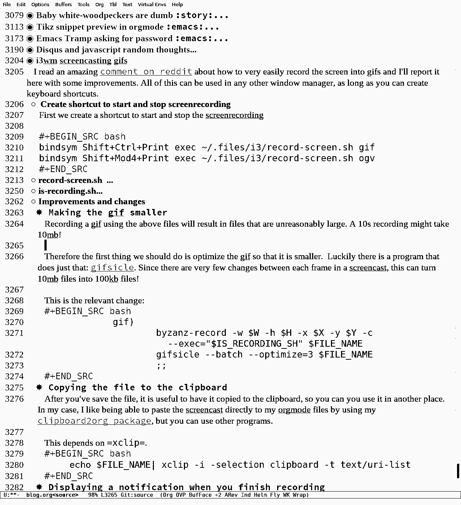

I read an amazing [comment on reddit](https://en.reddit.com/r/i3wm/comments/65vis5/screenshot_commands_from_my_i3_config/dgnic66/) about how to very easily record the screen into gifs and I'll report it here with some improvements. All of this can be used in any other window manager, as long as you can create keyboard shortcuts.


# Create shortcut to start and stop screenrecording

First we create a shortcut to start and stop the screenrecording

```sh
bindsym Shift+Ctrl+Print exec ~/.files/i3/record-screen.sh gif
    bindsym Shift+Mod4+Print exec ~/.files/i3/record-screen.sh ogv
```

# record-screen.sh

This is the file where most things happen.

**Dependencies:** `byzanz-record` , `slop`.

It uses `byzanz` to record the screen, and `slop` to select which screen to record from, as well as the `--exec` flag. `--exec` makes it so `byzanz` records until that process exists. This allows us to control exactly for how long the recording will last since we can simply kill it using our shortcut.
```sh
    #!/usr/bin/env bash
    DIR="$( cd "$( dirname "${BASH_SOURCE[0]}" )" && pwd )"
    IS_RECORDING_PID=`pgrep -a -f is-recording | cut -f1 -d' '`
    IS_RECORDING_SH=$HOME/.files/i3/is-recording.sh
    
    if [[ "$IS_RECORDING_PID" == "" ]]; then
    	read -r X Y W H < <(slop -n -l -c 0.157,0.333,0.466,0.4 -f "%x %y %w %h")
    	FILE_NAME=~/Videos/Screencast-$(date -Iseconds | cut -d'+' -f1).$1
    	case "$1" in
    		byzanz)
    			byzanz-record -w $W -h $H -x $X -y $Y -c --exec="$IS_RECORDING_SH" $FILE_NAME >& /dev/null
    			;;
    		gif)
    			byzanz-record -w $W -h $H -x $X -y $Y -c --exec="$IS_RECORDING_SH" $FILE_NAME >& /dev/null
    			;;
    		ogv)
    			byzanz-record -a -w $W -h $H -x $X -y $Y -c --exec="$IS_RECORDING_SH" $FILE_NAME >& /dev/null
    
    			if [[ "$2" == "--convert-to-gif" ]]; then
    				sleep 1
    				$DIR/convert-ogv-to-gif.sh $FILE_NAME | xclip -selection clipboard
    			fi
    			;;
    	esac
    else
    	polybar-msg hook is-recording 1
    	kill $IS_RECORDING_PID
    fi
```

# is-recording.sh

This is the process that when killed stops the recording. 

```sh
#!/usr/bin/env bash
    
    polybar-msg hook is-recording 2
    
    while true; do
    	sleep 60
    done
```


# Improvements and changes


## Making the gif smaller

Recording a gif using the above files will result in files that are unreasonably large. A 10s recording might take 10mb!

Therefore the first thing we should do is optimize the gif so that it is smaller.  Luckily there is a program that does just that: [gifsicle](https://github.com/kohler/gifsicle). Since there are very few changes between each frame in a screencast, this can turn 10mb files into 100kb files!

This is the relevant change:
```sh
    gif)
    	byzanz-record -w $W -h $H -x $X -y $Y -c --exec="$IS_RECORDING_SH" $FILE_NAME
    	gifsicle --batch --optimize=3 $FILE_NAME
    	;;
```

## Copying the file to the clipboard

After you've save the file, it is useful to have it copied to the clipboard, so you can you use it in another place. In my case, I like being able to paste the screencast directly to my orgmode files by using my [clipboard2org package](https://github.com/itf/clipboard2org/blob/master/clipboard2org.el), but you can use other programs.  

This depends on `xclip`.
```sh
    echo $FILE_NAME| xclip -i -selection clipboard -t text/uri-list
```

## Displaying a notification when you finish recording

I do not use polybar. So instead I use [notify-send.sh](https://github.com/vlevit/notify-send.sh) to send a notification when we finish the recording so I know that the command worked:

```sh
 ~/.config/i3/notify-send.sh/notify-send.sh -i display  "finished recording"
    fi
```


## Recording webms

Webms are better than gifs when supported. They are supported by basically everything, except IOS devices and internet explorer. In other words, it is even better than being supported everywhere haha. 

```sh
    webm)
    	byzanz-record -w $W -h $H -x $X -y $Y -c --exec="$IS_RECORDING_SH" $FILE_NAME
    	;;
```


## Putting it all together

This is the end result.  The **Dependencies:** `byzanz-record` , `slop`, `gifsicle`, `notify-send.sh`.

All  of the paths are based on the paths I've setup here, you should adapt them to your case.
```sh
    #!/usr/bin/env bash
    #!/usr/bin/env bash
    DIR="$( cd "$( dirname "${BASH_SOURCE[0]}" )" && pwd )"
    IS_RECORDING_PID=`pgrep -a -f is-recording | cut -f1 -d' '`
    IS_RECORDING_SH=$HOME/.tools/is-recording.sh
    
    if [[ "$IS_RECORDING_PID" == "" ]]; then
    	read -r X Y W H < <(slop -n -l -c 0.157,0.333,0.466,0.4 -f "%x %y %w %h")
    	FILE_NAME=~/Videos/Screencast-$(date -Iseconds | cut -d'+' -f1).$1
    	case "$1" in
    		byzanz)
    			byzanz-record -w $W -h $H -x $X -y $Y -c --exec="$IS_RECORDING_SH" $FILE_NAME 
    			;;
    		gif)
    			byzanz-record -w $W -h $H -x $X -y $Y -c --exec="$IS_RECORDING_SH" $FILE_NAME
    			gifsicle --batch --optimize=3 $FILE_NAME
    			;;
    		webm)
    			byzanz-record -w $W -h $H -x $X -y $Y -c --exec="$IS_RECORDING_SH" $FILE_NAME
    			;;
    		ogv)
    			byzanz-record -a -w $W -h $H -x $X -y $Y -c --exec="$IS_RECORDING_SH" $FILE_NAME 
    
    			if [[ "$2" == "--convert-to-gif" ]]; then
    				sleep 1
    				$DIR/convert-ogv-to-gif.sh $FILE_NAME | xclip -selection clipboard
    			fi
    			;;
    	esac
    	echo $FILE_NAME| xclip -i -selection clipboard -t text/uri-list
    else
    	#polybar-msg hook is-recording 1
    	kill $IS_RECORDING_PID
    	~/.config/i3/notify-send.sh/notify-send.sh -i display  "finished recording"
    fi
```


# Example!



