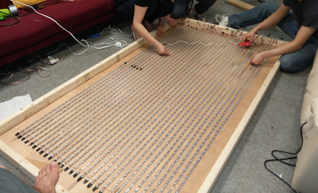
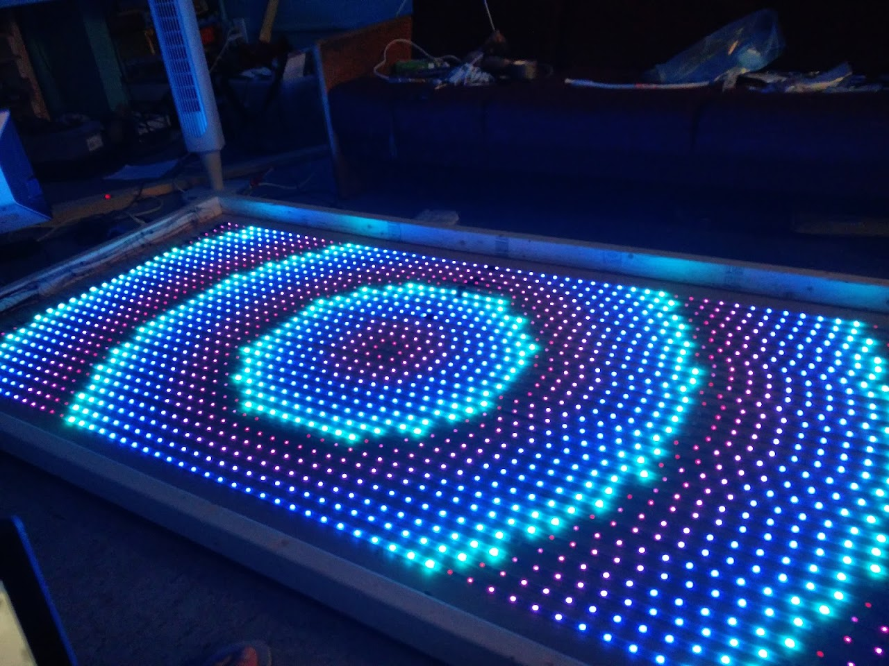

My friends and I built an led matrix with 30x60 pixels. This post will
focus mainly on the software, but first, let's skim through the
hardware.

# Material:

-   70 meters of ws2812 strips
-   A 90 amps, 5v power supply
-   20 feet of gauge 2 stranded copper wire.
-   A raspberry pi.
-   2 ethernet cables.
-   Speaker wire (any other medium-large wire would also work)
-   Female header pins
-   Hot glue
-   Plywood, 2x3s pieces of wood and diffuse vinyl fabric for the frame.

# Construction

The construction was simple, but took around 40 man hours.

First, we cut all the Led strips into 2meter strips, and soldered header
pins onto the cut parts.

We built the 1x2m frame by cutting the wood pieces onto the necessary
lengths at the store. We drilled holes on the frame and tied all the led
strips onto it, and then hot glued the strips.

For the power, we had a 90A, 5V power supply, connected using 2 10 feet
gauge 2 stranded copper wire (which minimized the voltage drop to around
0.2v); on the sides of the frame we attached 8 strands of speaker wire
and soldered wires to them.

The wires and strips were connected to each other, and held into place
by hot glue.

A raspberry pi connected to the Internet through Ethernet sends data to
the LEDs using a stripped Ethernet cable.

So far, the main difficulty was handling the voltage drop caused by
90amps going through the wires. Just get larger wires and you'll be good
to go, as long as you calculate the voltage drop before building it.

# Software

The software of this project was pretty fun to code and it is pretty fun
to use in my opinion.

All of it can be found in the
[*github repo of the project*](https://github.com/itf/led-curtain-2).
If you want to take a look at the details of each design choice, just
read the read-me of the github repo. This post describes what motivated
each design choice and when each module was built, and why.

Programming really complex effects is really hard and boring, so my main
objective was to make it possible to combine simple patters and effects
into more complex effects. More specifically those were the maing
objectives:

1- Capable of creating new functions by combining previous ones 2-
Reacts to music / beats 3- Few dependencies / dependencies that are easy
to install 4- Modular (can change the protocol to control other types of
LED screens, LED strips, increase the number of strips being controlled,
add plugins, etc) 5- Mostly in a single language 6- Ideally,
communication through UDP / WebRTC 7- Should run on Linux, Windows and
Mac.

This will be written in the order that things were coded. You should
skip direct to the patterns and effects session to see the cool parts!

## Starting

I started programming the led panel long before I had the LED panel. So
the first thing I needed, in my opinion, was a fake led panel.

I found a friend's project [Iron
Curtain](https://github.com/mlsteele/curtain) that had some code for a local display; a display that
mimecked an led panel. So I
[modified
the code](https://github.com/itf/led-curtain-2/blob/master/Display/Pygame/pgCurtain.py) to be able to handle an arbirtrary number of pixels.

After I had a way of testing my code, I needed a way of sending data. I
made a
["Client"
and a "Server"](https://github.com/itf/led-curtain-2/blob/master/Transportation/Sockets/ClientSocketUDP.py) that communicated using UDP. The client sent data to
the server, and the server sent the data to the local display. I wrote a
[few
tests](https://github.com/itf/led-curtain-2/blob/master/Tests/TestSendData.py) to make sure everything worked.

Now I needed a way to represent the pixels, in order to work with them.
I wrote a
[canvas
class](https://github.com/itf/led-curtain-2/blob/8536d31cf1e8a3a9d30239358a54033fddf5a044/ScreenCanvas.py) that I could use to represent the pixels of the screen, and that
could handle all edge cases (for example, what to do when trying to
address a pixel that is not on the screen?) I decided to handle such
edge cases by making the screen "repeatable and infinite" i.e. if you
address the pixel -1 you go back to the right most pixel.

After all the basics were built it was time to start building the
patterns.

## Patterns and effects

Patterns objective:

1- Be easy to modify or add effects (example: increase speed, change
colors, etc) 2- Be easy to combine 3- Possible to save to a file and
load from files.

How to make patterns in a way that it is easy to combine?

There are basically two options of how to make the patterns: they can be
functions or they can be objects.

One option was to have each pattern being an object, and having objects
that take other objects on their input to combine patterns. This would
allow to have states in a very simple way, and change the states in each
update. This is how 1e, a different hall in my dorm, does it, as seen on
their [gitrepo](https://github.com/FirstEast/1e-Disco/blob/master/server/pattern/pattern.py).

If they are functions they should be easier to compose; however, in
order to have an internal state, one needs to use closure, which can add
a lot of complexity to the code.

I first tried to make the patterns objects. But it was really hard for
me to reason about what was the right behavior for the patterns and how
to combine them in interesting ways without adding a lot of boiler plate
code. For example, what does it mean to take the mean of two (object)
patterns? It means to call a function in the the first pattern to
generate an image, do the same on the second pattern, and, at last,
create a new object that implements a function that generates this
particulat image.

Instead, I decided to make the patterns functions that, when possible,
don't haven an internal state.

### Why no internal state?

The main advantage of not having an internal state is that it allows one
to easily modify the patterns. Let's say that we want to generate a
circle that increases and decreases its size in each frame. One option
is to create a pattern that contains the circle radius as part of its
internal state and at each frame it changes the circle radius. This
works, but is rather hard to modify.

A simpler solution is to have a pattern that simply creates a circle and
takes as its input something that can be used to generate the circle
radius. At each step, we can have this input change, and, this way, we
can create any kind of pattern that involves circles that change sizes.

### What about this input?

You might ask now, what about this input? Wouldn't it be very specific
to each pattern and make it hard to modify or combine them? In theory,
this could be the case if you don't make the input generic enough. In
order to have it as generic as possible, the input was simply a python
dictionary.

On this input, which was conveniently called "Pattern Input" all the
necessary information related to patterns is stored. It stores the frame
number, the canvas that will contain the image that will be generated,
the radius of the circle, audio information, etc. And any pattern could
potentially modify it or have it modified by functions!

### Fast development

After defining the input to patterns all the development got faster.
Patterns were defined as "Functions that take pattern inputs and return
pattern inputs" . Functions were defined as "Functions that take
patterns and return patterns". Some of the basic patterns that I created
were: "Red": makes the canvas red. "Circle": makes a circle of radius
"cradius". "Trivial": returns the same pattern input that it received.

Some of the basic functions I created first were: "hue", shifits the hue
of the image by an specied amount. "Rainbow": shifts the hue by an
amount linearly dependent on the position.

Some of the auxiliary decorators I made in the code were: "defaultArgs":
add default arguments to the pattern input. An example is: the circle
gets the radius from the pattern input. However, if the pattern input
has no info about the circle radius, it should be initialized to a
default value.

This was enough to create many interesting and simple functions, but it
was not enough to generate arbitrarily complex functions.

The next milestone on the development, was when I created the function
"arg". Arg is the only function in the code that doesn't immediately
modify a pattern.

### What is arg?

I needed a way to modify the aruments to the functions. However, since
every function took a pattern and every pattern took a pattern input,
there was no where to modify the arguments themselves besides hard
coding them in the code. "Arg" is the function that solves this problem.

Arg is a function that takes a string and returns a "Function". Remember
that "Functions" are things that modify patterns. So far, "arg" is not
special. The special part is that it runs the string as if it was python
code, but from inside the context of the "Pattern Input". In other
words:

arg("cRadius=frame/10.%20")(circle)

Is a pattern that generates a circle whose radius depends on the frame
number. It is a pattern that evolves in time!

After arg was defined, lots of other patterns and functions were
created. Patterns that opened images, functions that took the mean of
patterns, etc.

### Problems with lack of states.

However, the design choice of abolishing internal states could only me
so far. I wanted to create transitions between patterns and patterns
such as the snake game.

To solve the problem of transitions, using closure, transitions keep
track of how much it has already transitioned between patterns. Because
of this, it is hard to modify the transitions themselves without changes
in the code.

To create patterns with internal states, the solution was similar,
certain patterns could have access to an internal dictionary that keeps
track of its internal state. As with the transtions, the internal state
can't be modified by other patterns. Even with those limitations, those
patterns could make extensive use of the rest of the functions. As soon
as I created a snake game pattern it was possible to blur the snakes,
change their color and make them brighter and darker with the rithm..

## Other small detais

This covers most of the development of the software. The audio
information are functions inside the pattern input, and any pattern can
make use of the audio.

The leds make use of a linear color profile, and therefore I had to
convert the colors from SRGB to linear before sending the data through
UDP.

The code was meant to be easy to develop and use, not meant to be fast.
In order to run it at fast speeds, you need to use pypy.

