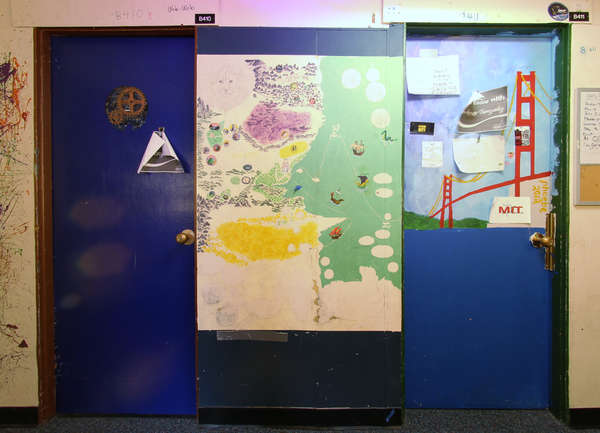

# Summary:

Photographing linear panoramas of murals, in a place with poor light conditions, and short distance to the wall.

# Intro

Photographing the murals in my dorm is a really challenging task. The
distance between the walls in the corridor is between 1.5m to 1.7m and
the height of the murals is approximately 2m.

Besides this, I don't have any special device to illuminate the walls,
besides a simple octopus floor lamp with yellowish incandescent lights.

Given these constrains I photographed the murals, and made the following
linear panoramas (click for full size)

# Hardware

-   Canon T2i with [*Magic Lantern*](http://www.magiclantern.fm/)
    installed
-   Opteka 6.5mm (Also known as Samyang 8mm, it is the same lens sold by
    a different company)
-   Octopus floor lamp (any floor lamp would work)
-   Tripod (set to around 1m)

# Software

-   Enfuse
-   Macrofusion
-   Hugin

# Work Flow

## Calibrate the Lens.

If your lens are not calibrated, this should be the first step, if not,
skip this session. At first, take a picture of a mural in a way that
there are many clear straight lines in the image. Load the image in
Hugin. The follow the
[*instruction on Hugin to calibrate your lens*](http://hugin.sourceforge.net/tutorials/calibration/en.shtml). Instead of using a diagonal line,
which might be hard to find, you can use multiple horizontal and
vertical lines. However, do not choose horizontal line on the options.

If you are using a non standard lens, such as the Samyang 8mm, it is
sometimes better to calibrate the lens for the approximate distance that
you are gonna take the pictures from.

## Taking the pictures.

Set your tripod to be about half of the right of the wall your are
photographing (in case it is very near you). If it is farther, or you
are not using fish-eye lens this won't affect you much.

Set your camera to fully manual mode, set the ISO to the lowest setting
(in order to minimize noise), set the focus to manual mode, and also set
the white balance to manual mode. It doesn't matter what setting you
choose for the white balance.

Take multiple pictures, moving the position of the lights between each
picture, but do not move the camera. This will assure you that you have
the whole scene well illuminated. Besides this, by having your light
coming from multiple directions, the end result will have even light,
which considerably improves the quality of the image (It makes it look
like a scanner)

In order to not move the camera, you should use a shutter cable, or
using the [*LCDsensor Remote*](http://wiki.magiclantern.fm/userguide)
shoot on shooting preferences of Magic Lantern, if you use a canon dlsr.

[)

[)

[)

## Fusing the images

:CUSTOM\_ID: fusing-the-images

To fuse the images, you should use
[Enfuse](http://wiki.panotools.org/Enfuse). Enfuse is a command line
tool for exposure fusing (it can also )

In order to better enfuse the pictures I recommend
[*Macrofusion*](http://sourceforge.net/projects/macrofusion/).
Macrofusion is a fast, simple and responsive GUI for Enfuse. Macrofusion
makes it easy to choose the weights of exposure, contrast and saturation
when fusing the images.

)

## Straightening the images.

Open the image in Hugin, and load the lens configuration for your lens.

Choose a rectilinear projection in Hugin's fast preview window.

[)

This should have straightened up the image. But there should still be
perspective problems. Set the horizon and vertical lines in the control
points tab and optimize the lens parameters. A full tutorial can be seen
on
[*Hugin's
SourceForge page*](http://hugin.sourceforge.net/tutorials/perspective/en.shtml)

Most of the times, Hugin white balance correction in the preview window
is enough to fix the image colors. And you just need to stitch the
image.

)

## Taking the other pictures

Move the camera to a new position and leave some overlap between the
images. It doesn't matter how much overlap you are leaving between the
images, in general, what matters is that the images overlap in a line
that can contain small errors.

## Stitching

The images of the linear panorama should be added one at a time,
therefore, you should start with a image that would be in the middle and
then move to the corners. Since this is a tutorial I will stitch only 2
images.

)

Load both of the images in Hugin, choosing the type of lens to be
rectilinear and choose some small value for the focal length, such as
10mm.

Set the control points between the images (you can also add lines) and
choose custom parameters for the geometric optimization. You should
probably set them by hand.

)

All but one picture parameters should be constant, because we are always
adding one image at a time. For the picture that you are optimizing, you
should optimize X, Y and HFOV. Since the pictures are already straight,
you shouldn't need to optimize roll.

If this optimization is not enough, you can optimize for other
parameters, but it is usually not necessary.

If there are areas between the images that don't match very well in
their intersection, it is generally better to add a mas in order to use
the result from a single image.

Choose custom parameters for photometric optimization. Again, always
change only one image at a time. The parameters that you should optimize
are EV, Er and Eb. Optimizing the lens parameters usually result in poor
blending for linear panoramas.

## Adding masks

If the images don't perfectly match on top of each other, you have 2
options:

-   Try to optimize other lens parameters
-   Add masks to include certain parts of an image or remove it from
    others.

Generally adding masks is faster and results in fewer problems.

You should also use masks to force Hugin to choose the image that has
the best resolution for areas where the details are important.

## Stitching

After you've added all the images it is time to stitch. If you are
stitching to JPG, you should keep the canvas size's dimensions below
232-1.

Choose exposure fused from any arrangement, click in calculate optimal
size if you simply want the largest resolution possible, and stitch!

[)
<small>
Mural stitched using only 2 control points</small>

Congratulations! You've finished your linear panorama.

## Common Problems

The horizon might start to bend. In order to fix this, create a horizon
line accross pictures, by adding control points for the horizon line
across different images.

