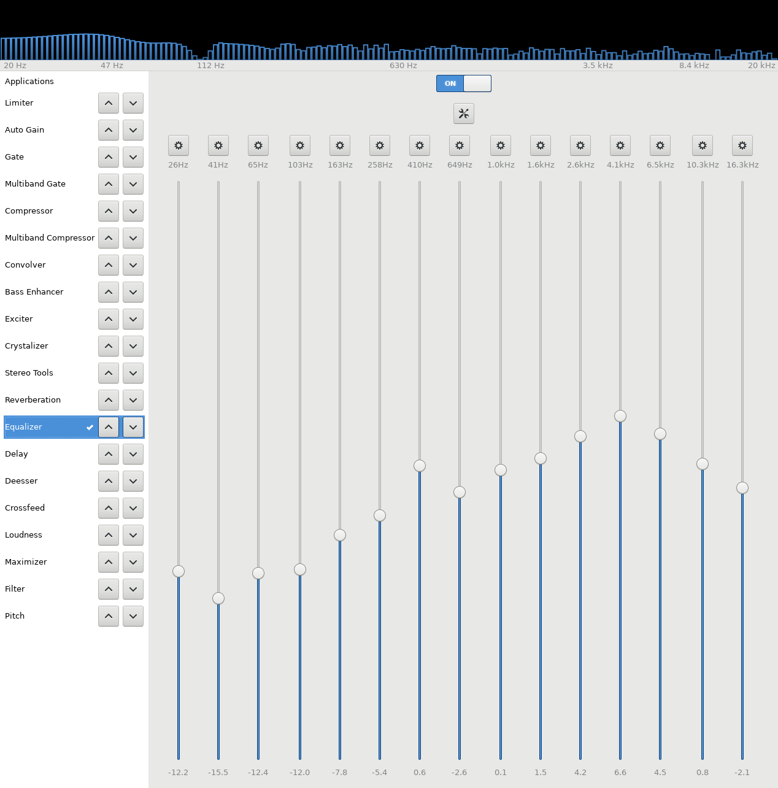
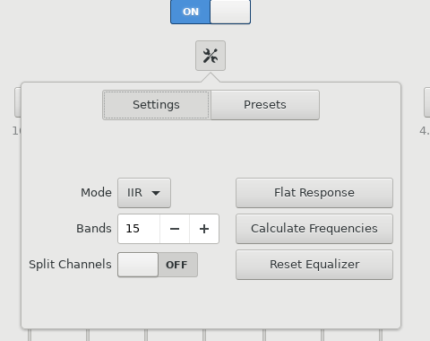

Cheap headphones sound bad because their frequency response is all messed up. You can considerably improve this by using an equalizer.

Assuming you are using pulseaudio.

First, install pulseeffects  and  Linux Studio Plugins 

    sudo apt install pulseeffects
    sudo apt install lsp-plugins

Now open pulseeffects, create a new profile

and then click in the equalizer

You have 2 options.

-   Simply listen to some song while moving the things up and down. By doing 3 or 4 passes throughout the frequencies while adjusting them, you can considerably improve them.
-   Use some tool to play sounds that will help you callibrate the headphone,

If you are doing option 2, I particularly like this website: <https://mynoise.net/calibration.php> . You try to adjust the noises until all frequencies sound the same. Once you've done so, you save the numbers, and insert them in the callibration in pulseeffects.

Change the number of bands to match the number of bands used by your noise generator. If using the above website, this number is 10.

Don't forget to save your profile so you can load it later.

