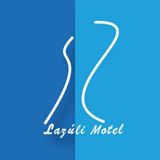
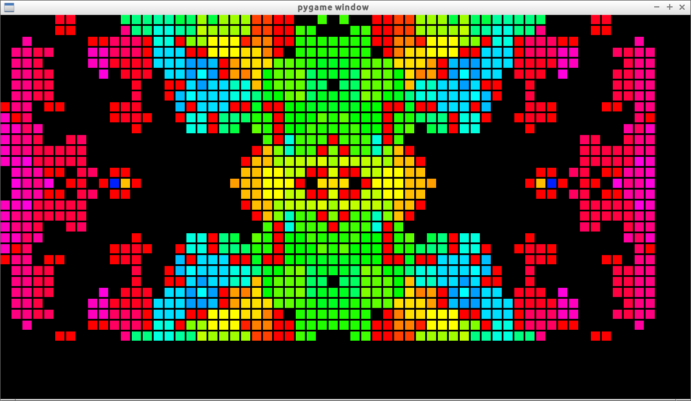

For my resume see [resume](resume.md). 

In construction.
Different projects I worked on over the years. Some very tiny,  some large ones.

# [Edge Matching with Inequalities, Triangles,Unknown Shape, and Two Players](https://arxiv.org/pdf/2002.03887.pdf)

2020- I was one of the author's for the paper Edge Matching with Inequalities, Triangles,Unknown Shape, and Two Players, in computational complexity.

# [Master's of Engineering Thesis](http://erikdemaine.org/theses/ifilho.pdf)

    2019 - 
My master's of engineering thesis in Boolean Satisfiability, supervised by Erik Demaine.

# [Autoscraper for Brazilian Science Olympiads](https://github.com/OlimpiadasCientificas/olimpiadascientificas.github.io/blob/master/_includes/olimpiadascraper.py)

2019 - 

A tool to scrape Brazilian Science Olympiad Websites for their news.

# [6.S092 Introduction to Algorithms ](https://github.com/itf/6s092)

2018-2019 I organized the class 6.S092 twice while at MIT. It was an IAP class (1 month long in January), using CATSOOP to teach people the basics of algorithms. 

# [Org export head](https://github.com/itf/org-export-head)

2018- Org mode to blog exporter. Converts each header to a different file. This blog was written using it!

# [Clipboard to Org Mode](https://github.com/itf/clipboard2org)

2018- Copy and paste HTML, Images or file lists into orgmode.

# [Groebner Basis for Linear Network Coding in Sage](groebner_basis_for_linear_network_coding_in_sage.md)

2018-  Proof of concept that it is possible, in a reasonable time, to test the
 solvability of linear networks by calculating the Groebner basis of the
 linear network ideal.

It implements an algorithm described on An Algebraic Approach to Network
Coding by Ralf Koetter, Member, IEEE, and Muriel Médard, Senior Member,
IEEE.

# [Yaoi on Fire - Photos](https://www.facebook.com/media/set/?set=a.1844569188904101.1073741855.100000531142103&type=1&l=71845e495e)

2017-  One of the photographers for the Yaoi on Fire performance of the MIT
 spinning arts club.

# Electric Skateboard

2017- For the class Intro to Making at MIT, my friends and I built an Electric
Skateboard.

# [The awakening (unfinished). Text based game](https://itf.github.io/the-awakening/)

2017- An experimental text based game inspired by “the space under the
window”, and by “A Dark Room”.

The user interacts with the text, and the text is written and rewritten
based on the interaction with the user.

The game is unfinished, and theres is only about 1 minute of gameplay at
the moment.

# [Facebook advertisement for Lazuli Motel](http://lazulimotel.com/)

2017- Created ad campaigns for the Lazuli Motel website I previously created
with a tight budget. For about $1 a day for 3 months, it brought
approximately 80 extra visitor to the website per day. The average time
spent per user on the website was 3 minutes.

It was not possible to analyze exactly how many clients the ad campaign
brought to the business, but given how many times the business got
contacted by phone during the ad campaign it seems that the campaign was
fairly successful.

# [Lazuli Motel Website and pictures](http://lazulimotel.com/)

2017- I took HDR pictures from the rooms of Lazuli Motel in Botuca, SP,
Brazil, and created a website for it, using Hugo as a static website
generator.

The website was intended to be accessed on 3g networks, so the image
quality and sizes were chosen in such a way to improve the user
experience, and it is also a single page website in order to not reload
already loaded information, and if the user's network fails, they can
still continue to see the information that has already been loaded.

# [Imagenet-download](https://github.com/itf/imagenet-download)

2016- A simple command line tool to download images from the imagenet dataset
while storing them with humanreadable names and ignoring images that are
too small.

# [Led Panel 30x60px](led_panel.md)

2016- My friends and I built a 30x60 pixels led panel, using Ws2812b strips. I
programmed the led panel graphics using Python, in a way that makes it
easy to combine patterns and functions into new patterns.

# [Maslab](http://maslab.mit.edu/wiki/index.php?title=Team_Six/Final_Paper)

2015- We built Cocoabot, a robot capable of finding cubes on a field and
stacking them by color. Cocoabot had around 10.000 lines of C++11 code,
split in 10 threads, running in an Intel Edison.

I was responsible for integrating the modules, writing the skeleton code
for the threads, designing the state machine and the motor-controllers
code, debugging the code with GDB and finding memory leaks. Documented
on tinyurl.com/cocoabot.

# L shaped wooden loft

2013- Designed and built an L-shaped wooden loft for me and my roommate during
my first month at MIT. The loft was very stable and at one moment had
over 6 people on top of it jumping and moving to confirm its stability.

# [Seeing around corners with a mobile phone? Synthetic aperture audio imaging](https://www.academia.edu/10724943/Seeing_around_corners_with_a_mobile_phone_Synthetic_aperture_audio_imaging)

2013- Undergraduate Researcher contribution to the paper "Seeing around corners with a mobile phone? Synthetic aperture audio imaging", in the Camera Culture group in the Media Lab.

# [IOL study guide (unfinished) (pt-br)](http://olimpiadascientificas.org/static/pdf/Linguistica0.8.pdf)

2012- Study guide for the International Linguistics Olympiad, in pt-br. I
wrote it as I was preparing to take part in IOL 2012 in Slovenia, in
order the following Brazilian teams to prepare for IOL.

# [Translation of IPhO formula sheet.](http://olimpiadascientificas.org/static/pdf/formulasheet-pt_br1.0.pdf)

2012- Translation of the 2012 IPhO formula sheet from English to Portuguese,
with minor edits to examples to make some concepts easier to understand.

# [Alone in the darkness. Text based game (inform7)](http://iplayif.com/?story=https://github.com/itf/Interactive-Narrative-Inform7/raw/master/aloneinthedarkness.z8)

2012- A text based game inspired by “the space under the window”, written in
inform 7.

The user interacts with the text, and the text is written and rewritten
based on the interaction with the user.

2019- The game was ported to javascript and now supports click instead of writing see: [alone in the darkness](a_game_from_the_past.md)

# [Olimpíadas Cientificas (Youtube Channel)](https://www.youtube.com/channel/UCUT87IB960L3foyy09gjmtw)

2012-2015. Youtube channel to spread information about Brazilian Science Olympiads. We interviewed participants of science competitions.

# [Vida de Olímpico (backup)](https://olimpiadascientificas.org/vida-de-olimpico/ivan.olimpiadascientificas.com/index.html)

2012-2015 Besides organizing my own personal website about science competitions, I helped other 10 students create and spread their blogs about their science competition experiences. I dare say it was a huge success and many students commented on our blogs saying we provided inspirations to them to take part in science competitions.

# [Ivan - Vida de Olímpico (backup)](https://olimpiadascientificas.org/vida-de-olimpico/ivan.olimpiadascientificas.com/index.html)

2012- 2013. Personal blog with stories about the time when I took part in Science Olympiads. At its peak, it received 50 unique visitors per day and top posts had a few dozen comments. It was created as a way to debunk myths about science olympiads as well as their competitors, as well as a way to stimulate people to take part in science olympiads, specially those from smaller towns around Brazil.   
I was originally from a small town and I didn't know how other people prepared for science competitions, since no one was taking part on them in my hometown. Through my blog I tried to provide a way to help people in similar situations.   
Some of the readers of the blog were later selected to represent Brazil on IBO, IPhO and IOAA, which was awesome.  
There was a problem with the wordpress database and the website went offline after a few years without being maintained; now we have a snapshot of how it was so others can still access it.

# [Olimpíadas Científicas](http://olimpiadascientificas.org/)

2009- now. First Brazilian website to help high school students and teachers to
participate in Science Olympiads.  
Used to have ∼500 visits per day.  
Made with wordpress.org, migrated to jekyll in 2016 after a problem with
the wordpress website. Dozens of volunteers have helped with the
website, helping provide material, write news and find information about
the competitions.

It was cited by the largest Brazilian newspaper in 2012,
tinyurl.com/ocientificas.

