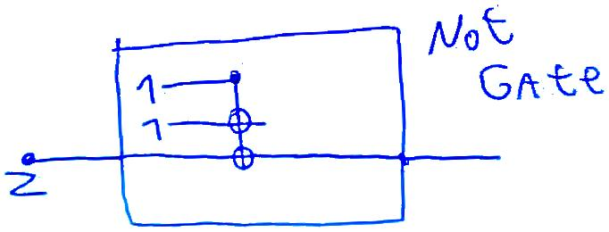

  After I wrote my last two tiny projects, [Scan with webcam](scan_notes_with_laptop_webcam.md), and [Export Subtree with files](export_subtree_with_files.md) I was ready to do one of my psets in org mode. It was absolutely fantastic.

Scanning images with my webcam made it very easy and fast to simply add diagrams to my solutions, such as the following.

[](./jpg/15371305333151052.jpg)

Being able to run arbitrary code during export allowed me to very easily generate matrices and perform matrix multiplication using sympy. For example:

```python
from sympy import I
    from sympy import latex
    from sympy.matrices import *
    import sys
    i=I
    
    sigmax = Matrix([[0,1],[1,0]])
    sigmay = Matrix([[0,-i],[i,0]])
    sigmaz = Matrix([[1,0],[0,-1]])
    
    print("\\begin{alignat*}{3}")
    print( "\\\\ \sigma_{x} \sigma_{x} &=" + latex(sigmax) + latex(sigmax) +" &&= " + latex(sigmax*sigmax) )
    print( "\\\\ \sigma_{y} \sigma_{y} &=" + latex(sigmay) + latex(sigmay) +" &&= " + latex(sigmay*sigmay) )
    print( "\\\\ \sigma_{z} \sigma_{z} &=" + latex(sigmaz) + latex(sigmaz) +" &&= " + latex(sigmaz*sigmaz) )
    
    print( "\\\\ \sigma_{x} \sigma_{y} &=" + latex(sigmax) + latex(sigmay) +" &&= " + latex(sigmax*sigmay) )
    print( "\\\\ \sigma_{y} \sigma_{z} &=" + latex(sigmay) + latex(sigmaz) +" &&= " + latex(sigmay*sigmaz) )
    print( "\\\\ \sigma_{z} \sigma_{x} &=" + latex(sigmaz) + latex(sigmax) +" &&= " + latex(sigmaz*sigmax) )
    
    print( "\\\\ \sigma_{y} \sigma_{x} &=" + latex(sigmay) + latex(sigmax) +" &&= " + latex(sigmay*sigmax) )
    print( "\\\\ \sigma_{z} \sigma_{y} &=" + latex(sigmaz) + latex(sigmay) +" &&= " + latex(sigmaz*sigmay) )
    print( "\\\\ \sigma_{x} \sigma_{z} &=" + latex(sigmax) + latex(sigmaz) +" &&= " + latex(sigmax*sigmaz) )
    print("\\\\ \\end{alignat*}")
```
$$
\begin{alignat*}{3}
\\ \sigma_{x} \sigma_{x} &=\left[\begin{matrix}0 & 1\\1 & 0\end{matrix}\right]\left[\begin{matrix}0 & 1\\1 & 0\end{matrix}\right] &&= \left[\begin{matrix}1 & 0\\0 & 1\end{matrix}\right]
\\ \sigma_{y} \sigma_{y} &=\left[\begin{matrix}0 & - i\\i & 0\end{matrix}\right]\left[\begin{matrix}0 & - i\\i & 0\end{matrix}\right] &&= \left[\begin{matrix}1 & 0\\0 & 1\end{matrix}\right]
\\ \sigma_{z} \sigma_{z} &=\left[\begin{matrix}1 & 0\\0 & -1\end{matrix}\right]\left[\begin{matrix}1 & 0\\0 & -1\end{matrix}\right] &&= \left[\begin{matrix}1 & 0\\0 & 1\end{matrix}\right]
\\ \sigma_{x} \sigma_{y} &=\left[\begin{matrix}0 & 1\\1 & 0\end{matrix}\right]\left[\begin{matrix}0 & - i\\i & 0\end{matrix}\right] &&= \left[\begin{matrix}i & 0\\0 & - i\end{matrix}\right]
\\ \sigma_{y} \sigma_{z} &=\left[\begin{matrix}0 & - i\\i & 0\end{matrix}\right]\left[\begin{matrix}1 & 0\\0 & -1\end{matrix}\right] &&= \left[\begin{matrix}0 & i\\i & 0\end{matrix}\right]
\\ \sigma_{z} \sigma_{x} &=\left[\begin{matrix}1 & 0\\0 & -1\end{matrix}\right]\left[\begin{matrix}0 & 1\\1 & 0\end{matrix}\right] &&= \left[\begin{matrix}0 & 1\\-1 & 0\end{matrix}\right]
\\ \sigma_{y} \sigma_{x} &=\left[\begin{matrix}0 & - i\\i & 0\end{matrix}\right]\left[\begin{matrix}0 & 1\\1 & 0\end{matrix}\right] &&= \left[\begin{matrix}- i & 0\\0 & i\end{matrix}\right]
\\ \sigma_{z} \sigma_{y} &=\left[\begin{matrix}1 & 0\\0 & -1\end{matrix}\right]\left[\begin{matrix}0 & - i\\i & 0\end{matrix}\right] &&= \left[\begin{matrix}0 & - i\\- i & 0\end{matrix}\right]
\\ \sigma_{x} \sigma_{z} &=\left[\begin{matrix}0 & 1\\1 & 0\end{matrix}\right]\left[\begin{matrix}1 & 0\\0 & -1\end{matrix}\right] &&= \left[\begin{matrix}0 & -1\\1 & 0\end{matrix}\right]
\\ \end{alignat*}
$$
So in the end I could solve my problem set very efficiently, without having to work around the tools I was using.

