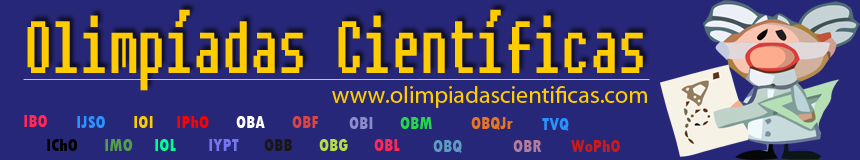

Until 2010 there were no website in Brazil one could access to learn about what [science olympiads](https://en.wikipedia.org/wiki/International_Science_Olympiad) existed nor how to study for them. The only way to learn about the existence of the competitions was to randomly search the internet until you found one you didn't know about, or to study in a large school that prepared students for those competitions. However, even if you did find out about those competitions, there was no way for one to discover what books they should study or how to better prepare for the science olympiads. And for the small schools admins, it was hard for them to keep track of all the different dates where the competitions happened or when they should register for them!

I was from a small town, and this had directly affected me, since I had to learn about the different competitions and prepare for them on my own. Because of this, once I moved to a larger city and started living away from family (when I was 15) to attend a larger school, I decided to start a blog and write about the main Brazilian Science Olympiads and how to study for them!

# [Projeto Olímpico](https://itadeufa.wordpress.com/)

After writing it for about a month, there was enough interest from friends that we changed the hosting from wordpress to [webnode](https://olimpiada.webnode.com.br/), which allowed for a bit more customization.  

# Olimpiadas.webnode.com.br

At this time, more people decided to join the project, and we became a team of 3 people.  We started receiving comments from students from all over Brazil, thanking us for the project. We started posting information about all the competitions as things happened. You could access our website to know what competitions had their registration open, which ones were releasing results and so on. We also improved our study guides and created pages for each science olympiad explaining what they were. We were even deciding on standards such as "when writing a post about a result, the post contains a single image at the top with the symbol of the competition, and we end the post with 'congratulations to all the winners!'".

We also bough our own domain! Olimpiadascientificas.com

About 10 months later, in late 2011, our website got popular enough that Augusto, a student from very far away decided to help us! He had experience with creating websites and blogs, so we moved it to our own VM running wordpress!

# [Olimpiadascientificas.com](http://web.archive.org/web/20160112231415/http://www.olimpiadascientificas.com/)

The website kept growing and the team kept growing. In 2012, when I appeared on Tv, newspapers and magazines, I advertised the website and we were getting Approximately 500 visits per day!

Our team was amazing, we had probably over 30 people. Most of them only contributed with a single post or so, while others contributes with dozens, and also many different pages or study materials.  I'd say that anyone in Brazil preparing for an International Science Olympiad was using our website.  There were people who lived near my small hometown who were preparing for the International Astronomy and Astrophysics Olympiad by using material we had shared, and they went to IOAA. 

We kept doing things! We created the first [Facebook group](https://www.facebook.com/groups/apoioolimpico/) for people to share information about science olympiads, as well as the first [Facebook page](https://www.facebook.com/OlimpiadasCientificas/) to share the news! At some point we had a twiter, and we had a [Youtube](https://www.youtube.com/channel/UCUT87IB960L3foyy09gjmtw) channel where we were interviewing students and asking about their experiences!

We kept the lists of the Brazilians who had gone to International Science Olympiads as well as a list of the awards received by Brazil. We were producing our own study material, and expanding our list of competitions to State competitions as well! We were also keeping track of pictures of all the Brazilian teams in the multiple international science olympiads and sharing them.

We started another project, [Vida de olímpico](https://olimpiadascientificas.org/vida-de-olimpico/) where people taking part in science competitions were writing blogs about their experiences. When I was in a small town, taking part in these competitions was a very lonely endeavor; by having a blog with other people sharing their experiences, the intention was to create a sense of community and also encourage people to keep going and keep studying and trying! Another intention was to debunk the myth that people taking part in those competitions had some type of divine gift that allowed them to be better than the others, since on the blogs we showed the amount of study that we had to put on. 

In my personal "vida de olímpico" blog, I was receiving around 50 visits per day and many comments and I truly believed things were a bit better because of all the information sharing we were promoting!

Some of the people who started writing those blogs, started writing them when they were just starting, and after a while they were traveling the world to go to science camps on trips they had won, and to International Science Olympiads! It was fantastic seeing their development! 

# The competitors and the downfall

But soon we started having people wanting to create their own websites about science olympiads, and then use their website to share their own facebook groups for people to study and discuss and so on. There was a split, and with most of the people in olimpiadascientificas graduating, we were not going to update the website as often and it was harder to find people to take over for us, since they went to other websites.  Then there were some problems with one of the people in the team deleting all the other people from our team and I not handling it very well. So our website kinda died.

The final blows to the website were when we stopped maintaining our wordpress server and because of vulnerabilities the website stopped being able to load. And later on, when we forgot to renew the domain and lost it.

Our main "[competitor](https://noic.com.br/)" is still going strong, and they copied multiple parts of our style to the dot! Which makes me happy, because even though our website mostly died, there are still others doing exactly what we wanted to do! And they have enough people in their team that they can focus on producing original content rather than just reporting news! More producing knowledge rather than just sharing how to access knowledge. I  just wish the menu on their website was easier to use, since I find it very hard to find the study page for any of their subjects, since it involves 3 clicks and accessing 3 different pages, and I also wish that they had a more searchable name, so that other people would more readily find them instead of us.

Our second [main competitor](https://obmepeiros.com.br/) went through the same rabbit hole we went once, but they went much deeper. In order to make their website cooler, they started adding more and more plugins, and images and javascript and all. It has reached the point where their website is so slow that I find it very bad to use&#x2026; It is sad, since otherwise they'd be helping a lot more people than they currently are.

# The memorial

After all the problems with wordpress and realizing that I wouldn't be able to maintain the website, I made a "memorial". I converted the website to a static generated website in jekyll, so it would be much faster. I deleted the news and posts and kept only the rest: information about the main science olympiads, how to study, and information about the teams. However, the saddest part was converting the "Vida de Olímpico" blogs to fixed pages, by using a webscrapper, since they were also could not be used anymore because of the un-maintained wordpress problems&#x2026;

We went from having 15k page views per day, on our most popular point, to now having only around 100 pageviews per day. I hope the students have been able to find the help they needed through other sources now.

# The post-mortem

Recently I've added a web scrapper that inserts the news of all the main Brazilian Science Olympiad websites to our front page, in the hope of redirecting students to what are the best sources of information now.

And in a few months I hope it will be possible for me to recover our original domain!

All in all, we managed to help thousands of people throughout the years, and it makes me happy to see some people that we helped in very amazing colleges!

